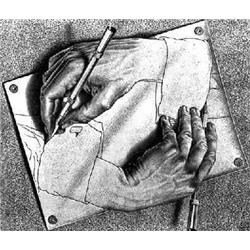
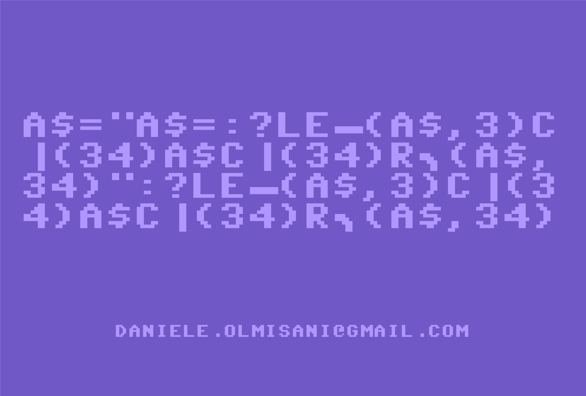

# My Quine page

Daniele Olmisani - <daniele.olmisani@gmail.com>, see [LICENSE](LICENSE) file.

 > `main(p){printf(p="main(p){printf(p=%c%s%1$c,34,p);}",34,p);}`
 
_by Dario Dariol_



A quine is a non-empty computer program which takes no input and produces a copy of its own source code as its only output. [Wikipedia](https://en.wikipedia.org/wiki/Quine_%28computing%29)

## Notes
Compile using: 

`$ g++ -std=c++17 quine.cpp -o quine`

Verify using: 

`$ ./quine | diff quine.cpp -`


## C++ Quines 

### My signature 

Please, refer to [quine.cpp](quine.cpp):

```c++
auto s = R"(
#include <iostream>
main() {
  std::cout << "auto s = R\"(" << s << ")\";" << s;
}
)";
#include <iostream>
main() {
  std::cout << "auto s = R\"(" << s << ")\";" << s;
}

```

### An other try 

Please, refer to [quine3.cpp](quine3.cpp):

```c++
#include<cstdio>
int main(){char n[]=R"(#include<cstdio>
int main(){char n[]=R"(%s%c";printf(n,n,41);})";printf(n,n,41);}
```

### An other try 

Please, refer to [quine2.cpp](quine2.cpp):

```c++
#include <iostream>
#include <string>

std::string s = R"(
#include <iostream>
#include <string>

std::string s = R"(
";

int main() {
  std::cout << s.replace(59, 1, s+')');
  return 0;
}
)";

int main() {
  std::cout << s.replace(59, 1, s+')');
  return 0;
}

```

### An other try 

Please, refer to [quine1.cpp](quine1.cpp):

```c++
#include <iostream>
#include <iomanip>

int main() {
  const char *s[] = {
    "    ",
    "#include <iostream>",
    "#include <iomanip>",
    "",
    "int main() {",
    "  const char *s[] = {",
    "  };",
    "  for(int i = 1; i < 6; ++i)",
    "    std::cout << s[i] << std::endl;",
    "  for(int i = 0; i < 15; ++i)",
    "    std::cout << s[0] << std::quoted(s[i]) << ',' << std::endl;",
    "  for(int i = 6; i < 15; ++i)",
    "    std::cout << s[i] << std::endl;",
    "  return 0;",
    "}",
  };
  for(int i = 1; i < 6; ++i)
    std::cout << s[i] << std::endl;
  for(int i = 0; i < 15; ++i)
    std::cout << s[0] << std::quoted(s[i]) << ',' << std::endl;
  for(int i = 6; i < 15; ++i)
    std::cout << s[i] << std::endl;
  return 0;
}

```

## Funny Quines

### CBM BASIC

A quine in CBM BASIC v2 that should be edited directly in a real Commodore 64.



### Natural Language


