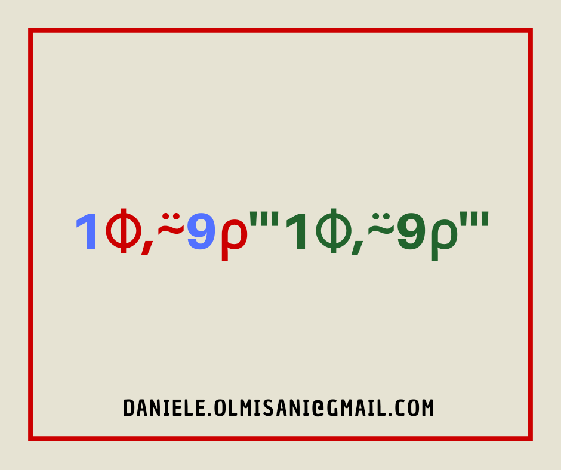

# Not so Quine

Daniele Olmisani - <daniele.olmisani@gmail.com>, see [LICENSE](LICENSE) file.

 > `main(p){printf(p="main(p){printf(p=%c%s%1$c,34,p);}",34,p);}`
 
_by Dario Dariol_


A quine is a non-empty computer program which takes no input and produces a copy of its own source code as its only output. [Wikipedia](https://en.wikipedia.org/wiki/Quine_%28computing%29)

## C++ Quines
Compile using: 

`$ g++ -std=c++17 quine.cpp -o quine`

Verify using: 

`$ ./quine | diff quine.cpp -`

### My signature 

Please, refer to [quine.cpp](quine.cpp):

```c++
auto s = R"(
#include <iostream>
main() {
  std::cout << "auto s = R\"(" << s << ")\";" << s;
}
)";
#include <iostream>
main() {
  std::cout << "auto s = R\"(" << s << ")\";" << s;
}

```

### An other try 

Please, refer to [quine3.cpp](quine3.cpp):

```c++
#include<cstdio>
int main(){char n[]=R"(#include<cstdio>
int main(){char n[]=R"(%s%c";printf(n,n,41);})";printf(n,n,41);}
```

### An other try 

Please, refer to [quine2.cpp](quine2.cpp):

```c++
#include <iostream>
#include <string>

std::string s = R"(
#include <iostream>
#include <string>

std::string s = R"(
";

int main() {
  std::cout << s.replace(59, 1, s+')');
  return 0;
}
)";

int main() {
  std::cout << s.replace(59, 1, s+')');
  return 0;
}

```

### An other try 

Please, refer to [quine1.cpp](quine1.cpp):

```c++
#include <iostream>
#include <iomanip>

int main() {
  const char *s[] = {
    "    ",
    "#include <iostream>",
    "#include <iomanip>",
    "",
    "int main() {",
    "  const char *s[] = {",
    "  };",
    "  for(int i = 1; i < 6; ++i)",
    "    std::cout << s[i] << std::endl;",
    "  for(int i = 0; i < 15; ++i)",
    "    std::cout << s[0] << std::quoted(s[i]) << ',' << std::endl;",
    "  for(int i = 6; i < 15; ++i)",
    "    std::cout << s[i] << std::endl;",
    "  return 0;",
    "}",
  };
  for(int i = 1; i < 6; ++i)
    std::cout << s[i] << std::endl;
  for(int i = 0; i < 15; ++i)
    std::cout << s[0] << std::quoted(s[i]) << ',' << std::endl;
  for(int i = 6; i < 15; ++i)
    std::cout << s[i] << std::endl;
  return 0;
}

```

## Other Quines

Other interesting quines.

### Rust

```rust
fn main(){print!("{}{0:?})}}","fn main(){print!(\"{}{0:?})}}\",")}
```

### Python 3

```python
_='_=%r;print(_%%_)';print(_%_) 
```

In **Python** the expression ```"name: %s" % value``` performs a string formatting similar to the C **printf** function. The **%r** formatter addes single quotes around the value and the double **%%** sign is an escaping sequence of the character **%**.

### APL



A trivial quine in APL is given by any expression:
```apl
0
```
that will be output printed as result.

Instead, an interisting and non-trivial quine is
```apl
1⌽,⍨9⍴'''1⌽,⍨9⍴'''
```
Try the code in [TryAPL](https://tryapl.org/)

Let's we will trying to understand.

APL expressions are evaluated right-to-left, so starting from the end
```apl
'''1⌽,⍨9⍴'''
```
is evaluated as 
```apl
'1⌽,⍨9⍴'
```
because ''' is an escaped single quote. 

then 
```apl
9⍴'''1⌽,⍨9⍴'''
```
is evaluated as 
```apl
'1⌽,⍨9⍴''
```
because 9⍴ will add a new element at the end of the 8 charater length string (repeting the string as needed).

then 
```apl
,⍨9⍴'''1⌽,⍨9⍴'''
```
is evaluated as 
```apl
'1⌽,⍨9⍴'''1⌽,⍨9⍴''
```
because ,⍨ will append its argument to itself (comma is the append operator, while ⍨ will duplicate the right argument as left argument).

then 
```apl
1⌽,⍨9⍴'''1⌽,⍨9⍴'''
```
is evaluated as 
```apl
1⌽,⍨9⍴'''1⌽,⍨9⍴'''
```
because 1⌽ will rotate the right argument of one position (left argument).


### CBM BASIC

Classic cheat.

```
1 LIST
```


A quine in CBM BASIC v2 that should be edited directly in a real Commodore 64.


Bit boring, but an actual quine.

```
1 READA$:PRINTA$CHR$(34)A$:DATA"1 READA$:PRINTA$CHR$(34)A$:DATA
```


Without any trick (just a little trouble in entering the last character, just go cursor back on the first char and press RETURN):

```
1 READA$:PRINTA$CHR$(34)A$CHR$(34):DATA"
1 READA$:PRINTA$CHR$(34)A$CHR$(34):DATA"
```


### Natural Language

A quine using natural language. 


